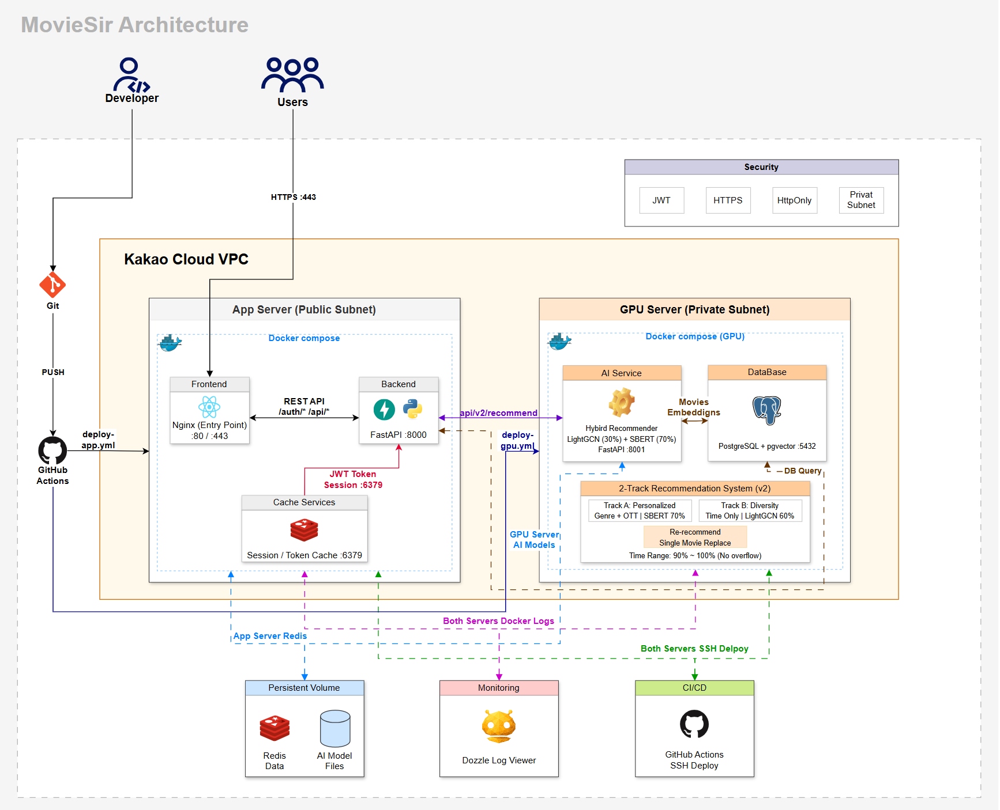

<div align="center">


### **당신의 이동 시간에 딱 맞는 영화를 찾아드립니다**

<br/>

[](https://react.dev/)
[](https://fastapi.tiangolo.com/)
[](https://www.python.org/)
[](https://www.typescriptlang.org/)
[](https://www.postgresql.org/)
[](https://redis.io/)
[](https://www.docker.com/)
[](https://cloud.kakao.com/)

</div>

---

## 프로젝트 소개

> **"비행기 탑승 시간이 5시간인데, 뭐 볼까?"**

이 단순한 질문에서 **무비서(MovieSir)** 가 시작되었습니다.

<table>
  <tr>
    <td width="50%">
      <h4>문제점</h4>
      <ul>
        <li>기존 추천 서비스는 <b>"이 영화 어때요?"</b>만 제안</li>
        <li>내 이동 시간에 맞는지는 알 수 없음</li>
        <li>여러 영화를 조합해서 보고 싶을 때 불편</li>
      </ul>
    </td>
    <td width="50%">
      <h4>해결책</h4>
      <ul>
        <li>이동 시간 입력 → <b>최적 영화 조합</b> 추천</li>
        <li>AI 기반 개인화 + 다양성 동시 제공</li>
        <li>OTT 플랫폼별 필터링 지원</li>
      </ul>
    </td>
  </tr>
</table>

### 타겟 사용자

| 대상           | 상황                               |
| -------------- | ---------------------------------- |
| 비행기 탑승객  | 장거리 국제선 비행 중 영화 감상    |
| KTX/SRT 이용자 | 2-3시간 이동 시간 활용             |
| 버스 여행자    | 장거리 버스 이동 중 콘텐츠 소비    |
| 일반 사용자    | 제한된 시간 내 최적 영화 조합 탐색 |

<br/>

## 주요 기능

| 기능                   | 설명                                                          |
| ---------------------- | ------------------------------------------------------------- |
| **시간 맞춤 추천**     | 이동 시간을 입력하면 러닝타임 합이 딱 맞는 영화 조합을 추천   |
| **AI 하이브리드 추천** | SBERT + LightGCN 2-Track 추천 시스템으로 정확도와 다양성 확보 |
| **OTT 필터링**         | 구독 중인 OTT 플랫폼에서 바로 볼 수 있는 영화만 추천          |
| **온보딩 시스템**      | 초기 영화 취향 설문으로 개인화된 추천 제공                    |

### 2-Track 추천 시스템

|    Track    |    목적     |      알고리즘 비율       | 설명                       |
| :---------: | :---------: | :----------------------: | :------------------------- |
| **Track A** |  맞춤 추천  | SBERT 70% + LightGCN 30% | 선호 장르 기반 개인화 추천 |
| **Track B** | 다양성 추천 | SBERT 40% + LightGCN 60% | 새로운 장르 탐색 유도      |

<br/>

## 시스템 아키텍처

<div align="center">
  
</div>

<br/>

## 시작하기

### Prerequisites

| Requirement             | Version    |
| ----------------------- | ---------- |
| Node.js                 | 18+        |
| Python                  | 3.11+      |
| Docker & Docker Compose | Latest     |
| PostgreSQL              | 16         |
| GPU (AI Server)         | CUDA 11.8+ |

### 1. Clone Repository

```bash
git clone https://github.com/Movigation/MovieSir.git
cd MovieSir
```

### 2. Database Setup

[Google Drive](https://drive.google.com/drive/folders/1mPbfGbdbMoxBIR7w0HuMHFaFjkM9zbYa)에서 `movigation_2.sql` 다운로드

```bash
mv movigation_2.sql database/init/
```

### 3. AI Model Setup

| File              | Download                                                                             | Path                          |
| ----------------- | ------------------------------------------------------------------------------------ | ----------------------------- |
| `id_mappings.pkl` | [Download](https://drive.google.com/drive/folders/1iRunFaexhRYcaUPieChS_I3XM8gDcMxM) | `ai/training/lightgcn_data/`  |
| `best_model.pt`   | [Download](https://drive.google.com/drive/folders/1ZsJWJjOI76UKURp2Oj04wekTR6KVZN2S) | `ai/training/lightgcn_model/` |

### 4. Run with Docker

```bash
# Production
docker compose --env-file .env.production up -d --build

# GPU Server (AI)
docker compose -f docker-compose.gpu.yml up -d --build
```

### Local Development

```bash
# Frontend (Terminal 1)
cd frontend && npm install && npm run dev

# Backend (Terminal 2)
cd backend && pip install -r requirements.txt && uvicorn main:app --reload

# AI Server (Terminal 3 - GPU Required)
cd ai && pip install -r requirements.txt && uvicorn api:app --reload --port 8001
```

<br/>

## 프로젝트 구조

```
MovieSir/
│
├── frontend/                    # React + TypeScript + Vite
│   ├── src/
│   │   ├── api/                 # API 클라이언트
│   │   ├── components/          # 재사용 컴포넌트
│   │   ├── pages/               # 페이지 컴포넌트
│   │   ├── store/               # Zustand 상태관리
│   │   └── services/            # 비즈니스 로직
│   └── package.json
│
├── backend/                     # FastAPI + SQLAlchemy
│   ├── domains/
│   │   ├── auth/                # 인증 (JWT)
│   │   ├── registration/        # 회원가입
│   │   ├── onboarding/          # 온보딩 플로우
│   │   ├── recommendation/      # 추천 API
│   │   ├── user/                # 사용자 관리
│   │   └── movie/               # 영화 데이터
│   ├── core/                    # DB 설정
│   └── requirements.txt
│
├── ai/                          # SBERT + LightGCN 추천 엔진
│   ├── api.py                   # FastAPI 서버
│   ├── hybrid_recommender_v2.py # 하이브리드 추천 로직
│   └── training/                # 모델 & 학습 데이터
│
├── database/                    # PostgreSQL + pgvector
│   └── init/                    # 초기화 SQL
│
├── .github/workflows/           # CI/CD
├── docker-compose.yml           # Production 설정
└── docker-compose.gpu.yml       # GPU 서버 설정
```

<br/>

## API 엔드포인트

| Method | Endpoint                   | Description      |
| ------ | -------------------------- | ---------------- |
| `POST` | `/auth/login`              | 로그인           |
| `POST` | `/auth/signup/request`     | 회원가입 요청    |
| `POST` | `/onboarding/ott`          | OTT 플랫폼 선택  |
| `POST` | `/onboarding/survey`       | 영화 취향 설문   |
| `POST` | `/api/v2/recommend`        | 영화 추천 요청   |
| `POST` | `/api/v2/recommend/single` | 개별 영화 재추천 |
| `GET`  | `/api/movies/{id}`         | 영화 상세 정보   |

<br/>

<div align="center">

## 팀원

<table>
  <tr>
    <td align="center"><a href="https://github.com/qkqqkqkq"><br /><sub><b>문수현</b></sub></a><br/><sub>PM</sub></td>
    <td align="center"><a href="https://github.com/Dieod1598741"><br /><sub><b>한대연</b></sub></a><br/><sub>Frontend</sub></td>
    <td align="center"><a href="https://github.com/tinytinalee"><br /><sub><b>이승원</b></sub></a><br/><sub>Backend</sub></td>
    <td align="center"><a href="https://github.com/wldn7601"><br /><sub><b>박지우</b></sub></a><br/><sub>AI/ML</sub></td>
    <td align="center"><a href="https://github.com/leelaeloo"><br /><sub><b>이태수</b></sub></a><br/><sub>Infra/DevOps</sub></td>
  </tr>
</table>

</div>

<br/>

---

<div align="center">

</div>
