<div align="center">


[](https://moviesir.cloud)
[](https://demo.moviesir.cloud)
[](https://api.moviesir.cloud)
[](https://console.moviesir.cloud)

</div>

---

## 📌 프로젝트 소개

### 배경

전 세계 소비자는 시청할 콘텐츠를 검색하는 데 **평균 14분**을 소비합니다.

| 지표                             | 수치 |
| -------------------------------- | ---- |
| 콘텐츠 검색 실패 시 시청 포기율  | 19%  |
| 18~24세 시청 포기율              | 29%  |
| 검색 어려움으로 서비스 취소 의향 | 49%  |

<br/>

### 무비서의 해결책

**무비서(MovieSir)** 는 이 문제를 해결합니다.

| 기존 문제                   | 무비서 솔루션                            |
| --------------------------- | ---------------------------------------- |
| "이 영화 어때요?" 단순 추천 | AI 기반 개인화 + 다양성 동시 제공        |
| 내 시간에 맞는지 알 수 없음 | 이동 시간 입력 → **최적 영화 조합** 추천 |
| 여러 영화 조합이 불편함     | OTT 플랫폼별 필터링 지원                 |

<br/>

### 타겟 사용자

| 대상           | 상황                               |
| -------------- | ---------------------------------- |
| 비행기 탑승객  | 장거리 국제선 비행 중 영화 감상    |
| KTX/SRT 이용자 | 2-3시간 이동 시간 활용             |
| 버스 여행자    | 장거리 버스 이동 중 콘텐츠 소비    |
| 일반 사용자    | 제한된 시간 내 최적 영화 조합 탐색 |

<table>
  <tr>
    <td width="50%" align="center" valign="bottom">
      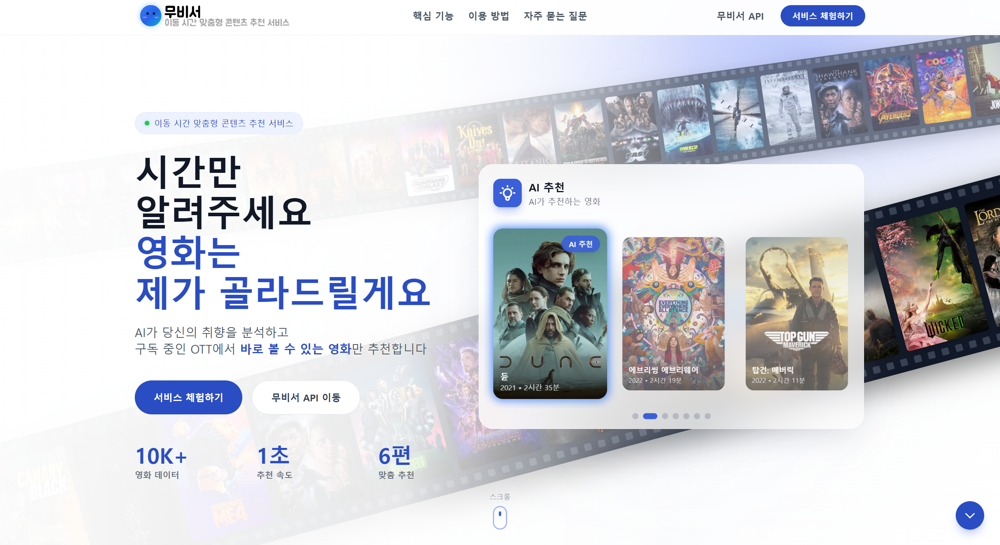
      <br/><sub><b>무비서 소개</b></sub>
    </td>
    <td width="50%" align="center" valign="bottom">
      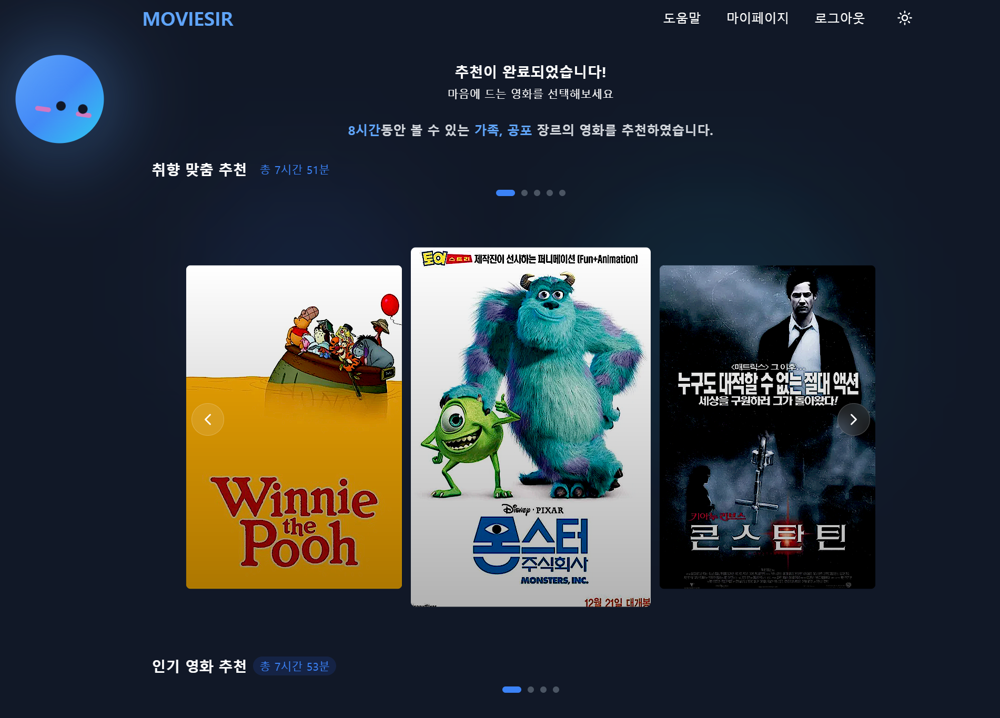
      <br/><sub><b>무비서 B2C</b></sub>
    </td>
  </tr>
</table>

<br/>

---

## ⚙️ 주요 기능

| 기능                   | 설명                                                        |
| ---------------------- | ----------------------------------------------------------- |
| **시간 맞춤 추천**     | 이동 시간을 입력하면 러닝타임 합이 딱 맞는 영화 조합을 추천 |
| **AI 하이브리드 추천** | SBERT + ALS 2-Track 추천 시스템으로 정확도와 다양성 확보    |
| **OTT 필터링**         | 구독 중인 OTT 플랫폼에서 바로 볼 수 있는 영화만 추천        |
| **온보딩 시스템**      | 초기 영화 취향 설문으로 개인화된 추천 제공                  |

<br/>

### 2-Track 추천 시스템

|    Track    |    목적     |    알고리즘 비율    | 설명                       |
| :---------: | :---------: | :-----------------: | -------------------------- |
| **Track A** |  맞춤 추천  | SBERT 70% + ALS 30% | 선호 장르 기반 개인화 추천 |
| **Track B** | 다양성 추천 | SBERT 40% + ALS 60% | 새로운 장르 탐색 유도      |

---

## 🤓 AI 모델 선정 과정

> **평가 지표 설명**
>
> | 지표                        | 의미                                                       |
> | --------------------------- | ---------------------------------------------------------- |
> | **Precision@K** (정확도)    | 추천한 K개 중 사용자가 실제로 선호한 아이템의 비율         |
> | **Recall@K** (재현율)       | 사용자가 선호하는 전체 아이템 중 K개 추천 안에 포함된 비율 |
> | **NDCG@K** (추천 랭킹 품질) | 사용자가 가장 좋아할 아이템이 얼마나 상위권에 배치되었는가 |

<br/>

### 콘텐츠 기반 필터링 (CBF)

콘텐츠 기반 필터링 모델 중 **TF-IDF, Word2Vec, SBERT** 3개를 비교하여, <br />영화의 의미론적 유사성을 가장 잘 포착하는 모델을 선정했습니다.

- 각 모델로 임베딩한 고차원 벡터 값을 **2차원으로 축소(t-SNE)** 하여 장르별 색깔에 맞게 좌표에 점으로 표시
- **같은 색깔의 점들끼리 모여 있음** → 비슷한 의미의 영화끼리 모여 있음 (군집화가 잘 됨)
- **다른 색깔의 점들끼리 떨어져 있음** → 비슷하지 않은 영화는 떨어져 있음 (분리도가 높음)
- SBERT가 영화의 의미론적 유사성을 **가장 잘 포착**

<div align="center">
  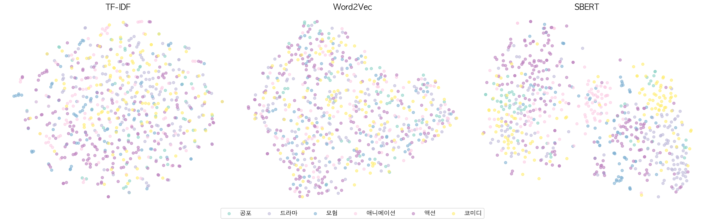
  <sub><b>TF-IDF vs Word2Vec vs SBERT — t-SNE 시각화 비교</b></sub>
</div>

<br/>

<div align="center">
  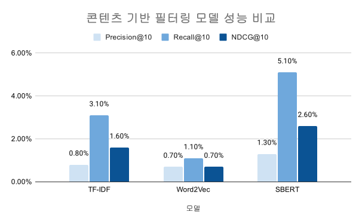
  <br/><sub><b>TF-IDF vs Word2Vec vs SBERT — 성능 비교</b></sub>
</div>

<br/>

SBERT 모델 중 **e5-small, e5-large, MiniLM, bge-m3, ko-sroberta** 5개를 비교하여 최종 모델을 선정했습니다.

- 영화 추천 서비스이기 때문에 **추천 품질과 순위가 중요**
- 처리 시간은 좀 걸리지만 추천 품질과 순위의 성능이 좋은 **e5-large 모델을 선택**

<div align="center">
  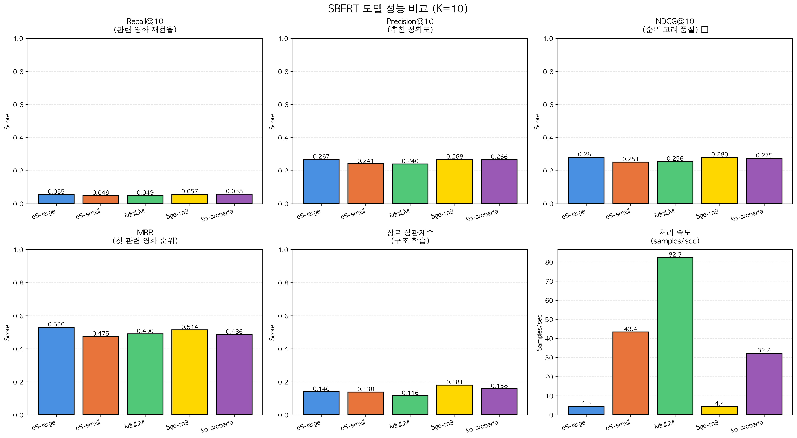
  <sub><b>SBERT 모델 성능 비교 (K=10)</b></sub>
</div>

<br/>

### 협업 필터링 (CF)

협업 필터링 모델 중 **ALS, LightGCN, NCF (NeuMF)** 3개를 비교하여 최적 모델을 선정했습니다.

<div align="center">
  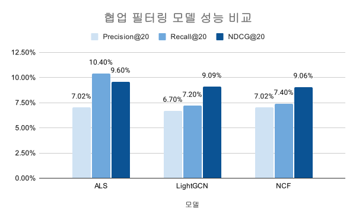
  <br/><sub><b>ALS vs LightGCN vs NCF — 성능 비교 (1)</b></sub>
</div>

<br/>

<div align="center">
  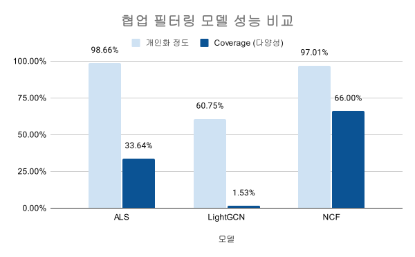
  <br/><sub><b>ALS vs LightGCN vs NCF — 성능 비교 (2)</b></sub>
</div>

<br/>

---

## 💻 시스템 아키텍처

<div align="center">
  
</div>

<br/>

### 인프라 구성

| 서버           | 스펙                     | 구성                    | 포트           | 역할                         |
| -------------- | ------------------------ | ----------------------- | -------------- | ---------------------------- |
| **App Server** | t1i.xlarge (4vCPU, 16GB) | Nginx + FastAPI + Redis | 80, 443, 52222 | 웹 서버, API 처리, 세션 관리 |
| **GPU Server** | gn1i.xlarge (Tesla T4)   | PostgreSQL + AI Service | 22, 5432, 8001 | 데이터베이스, 추천 엔진      |

<br/>

### 네트워크 구성

| 구분               | 대역         | 용도                   |
| ------------------ | ------------ | ---------------------- |
| **VPC**            | 10.0.0.0/16  | 전체 네트워크          |
| **Public Subnet**  | 10.0.0.0/20  | App Server (외부 접근) |
| **Private Subnet** | 10.0.32.0/20 | GPU Server (내부 전용) |

<br/>

### 보안 구성

| 항목           | 설정                                                                          |
| -------------- | ----------------------------------------------------------------------------- |
| **SSH 접근**   | App Server를 Bastion Host로 사용, 비표준 포트(52222) 적용으로 브루트포스 방지 |
| **GPU Server** | Private Subnet 배치, Public IP 미부여                                         |
| **보안그룹**   | 서비스별 최소 포트만 허용 (80, 443, 52222 / 22, 5432, 8001)                   |
| **CI/CD**      | GitHub Actions + SSH 키 기반 자동 배포                                        |

**클라우드**: Kakao Cloud VPC 환경에서 운영

> 📂 Nginx, Cron, 운영 스크립트 등 자세한 서버 설정은 [`infra/`](./infra/) 폴더를 참고하세요.

<br/>

## ⏱️ API 레이턴시 측정

AI 추천 엔진의 응답 속도를 3회 반복 측정한 결과, **모든 구간에서 목표(1초 이내)를 달성**했습니다.

| 측정 구간             | 평균 응답 | 설명                              |
| --------------------- | --------- | --------------------------------- |
| **AI Service Direct** | ~200ms    | GPU Server 내부 AI 엔진 직접 호출 |
| **B2B External API**  | ~360ms    | Nginx → FastAPI → AI 전체 경로    |

<div align="center">
  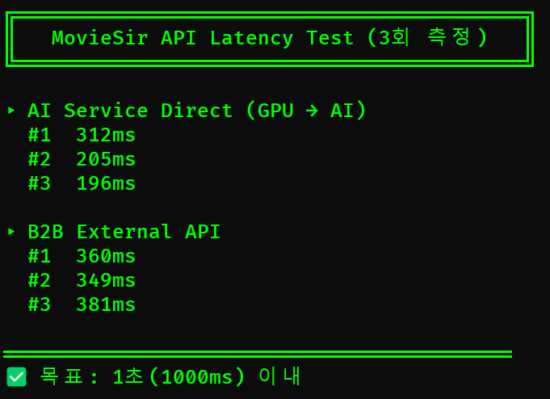
  <br/><sub><b>App Server에서 측정한 API 레이턴시 (3회 평균)</b></sub>
</div>

<br/>

## 🏁 ERD

<div align="center">
  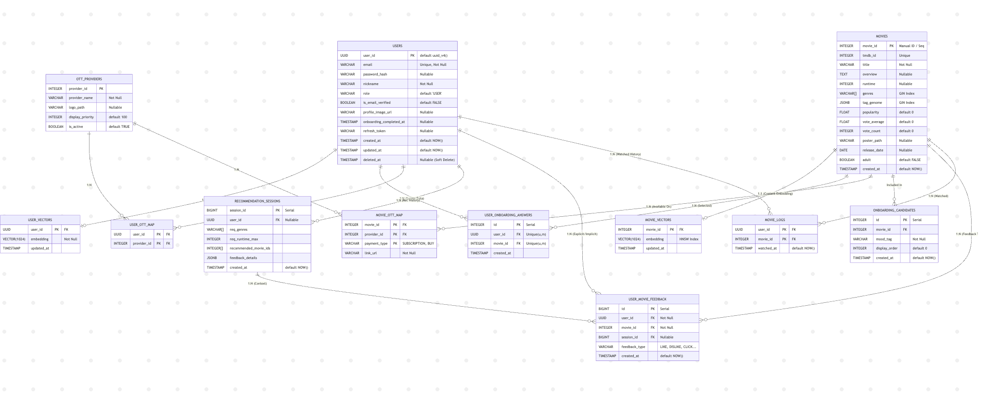
  <br/><sub><b>B2C 스키마</b> — 사용자, 추천, 피드백</sub>
</div>

<br/>

<div align="center">
  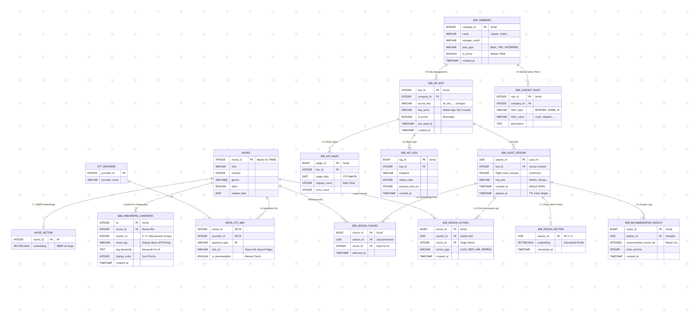
  <br/><sub><b>B2B 스키마</b> — 기업, API 키, 사용량</sub>
</div>

<br/>

---

## 🔷 [무비서 B2B API](https://api.moviesir.cloud)

<div align="center">
  
</div>

<br/>

> **출발부터 도착까지, 낭비 없는 완벽한 이동 경험을 제공합니다.**

항공사, OTT 플랫폼 등 기업 고객을 위한 AI 영화 추천 API입니다.<br/>
`X-API-Key` 헤더 인증 방식으로, 요금제(FREE · BASIC · PRO · ENTERPRISE)에 따라 호출 한도가 적용됩니다.

### API 엔드포인트

| 메서드 | 경로                   | 설명             |
| ------ | ---------------------- | ---------------- |
| POST   | `/v1/recommend`        | 영화 조합 추천   |
| POST   | `/v1/recommend_single` | 개별 영화 재추천 |

### 사용 예시

```bash
curl -X POST "https://api.moviesir.cloud/v1/recommend" \
  -H "X-API-Key: sk-moviesir-your-api-key" \
  -H "Content-Type: application/json" \
  -d '{"genres": ["액션"], "runtime_limit": 180}'
```

<table>
  <tr>
    <td width="50%" align="center" valign="bottom">
      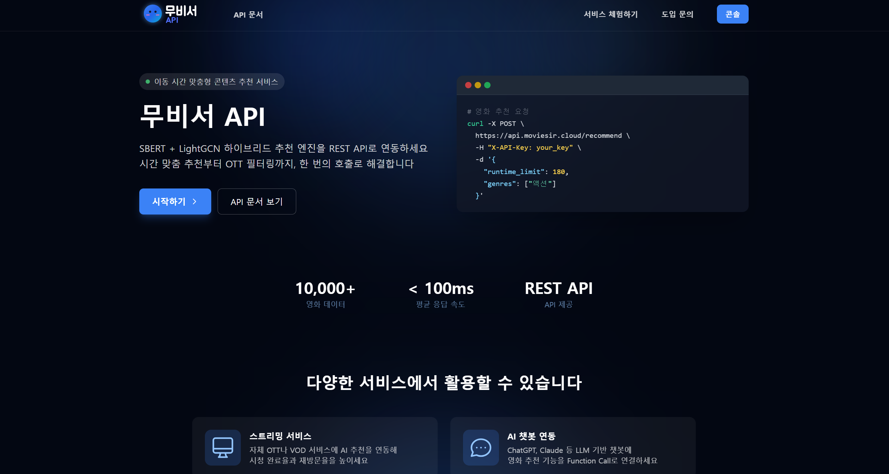
      <br/><sub><b>API 소개</b></sub>
    </td>
    <td width="50%" align="center" valign="bottom">
      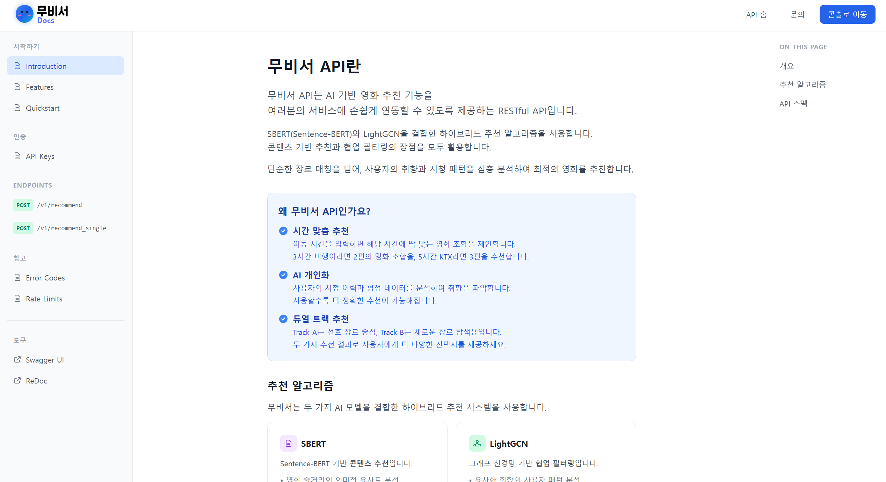
      <br/><sub><b>API 문서 (Swagger)</b></sub>
    </td>
  </tr>
</table>

<br/>

---

## ✈️ 무비서 B2B API 연동 사례: [Air-Demo](https://github.com/Movigation/Air-Demo)

### "개인 서비스(B2C)를 넘어 항공사 솔루션(B2B)으로"

항공사 기내 영화 추천 데모앱 [**Air-Demo**](https://github.com/Movigation/Air-Demo)가 무비서 B2B API를 실제로 연동하여, <br />비행 시간에 맞는 최적의 영화 조합을 추천합니다.

> **크로스 클라우드 호환성 검증** ➡️ GCP(Cloud Run)에서 KakaoCloud VPC의 무비서 API를 호출<br />
> 본 애플리케이션의 UI/UX 디자인 및 프론트엔드/백엔드 구현은 **Movigation 팀**이 직접 설계하고 개발하였습니다.

<table>
  <tr>
    <td width="33%" align="center" valign="bottom">
      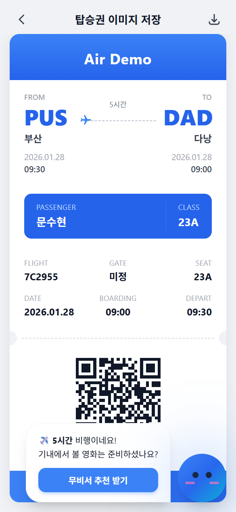
      <br/><sub><b>탑승권 화면</b></sub>
    </td>
    <td width="33%" align="center" valign="bottom">
      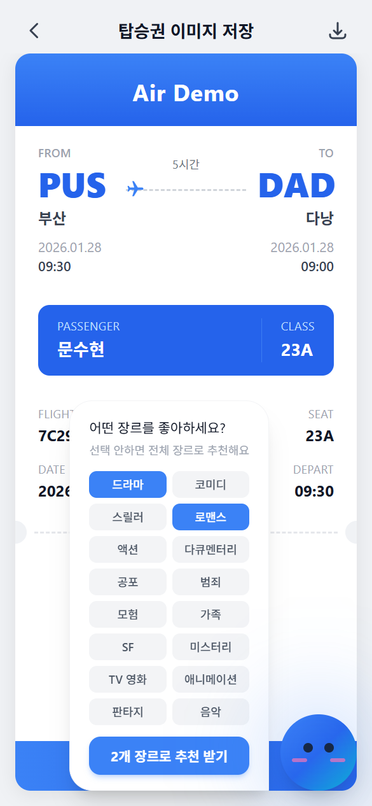
      <br/><sub><b>장르 선택</b></sub>
    </td>
    <td width="33%" align="center" valign="bottom">
      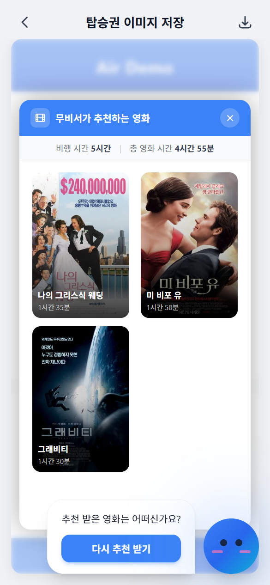
      <br/><sub><b>영화 추천 결과</b></sub>
    </td>
  </tr>
</table>

<br/>

---

## 🔷 [무비서 Console](https://console.moviesir.cloud)

<div align="center">
  
</div>

<br/>

> **한눈에 볼 수 있는 API 사용량**

API 키 관리 및 사용량 모니터링 대시보드입니다.<br/>
기업 고객이 API 사용 현황을 실시간으로 확인하고 관리할 수 있습니다.

### 주요 기능

| 기능            | 설명                        |
| --------------- | --------------------------- |
| **대시보드**    | 일별/월별 API 호출량 시각화 |
| **API 키 관리** | 키 발급, 비활성화, 삭제     |
| **사용량 분석** | 실시간 로그, 응답 시간 통계 |
| **Playground**  | API 테스트 환경             |

<table>
  <tr>
    <td width="75%" align="center" valign="bottom">
      
      <br/><sub><b>대시보드</b> - API 사용량 및 통계 시각화</sub>
    </td>
    <td width="25%" align="center" valign="bottom">
      
      <br/><sub><b>PWA</b> - 모바일 앱 지원</sub>
    </td>
  </tr>
</table>

<br/>

---

## ✅ 시작하기

### 사전 요구사항

| 항목                    | 버전       |
| ----------------------- | ---------- |
| Node.js                 | 18+        |
| Python                  | 3.11+      |
| Docker & Docker Compose | Latest     |
| PostgreSQL              | 16         |
| GPU (AI Server)         | CUDA 11.8+ |

<br/>

### 1. 레포지토리 클론

```bash
git clone https://github.com/Movigation/MovieSir.git
cd MovieSir
```

### 2. 환경변수 설정

```bash
cp .env.example .env.local
# .env.local 파일을 열어 필요한 값 수정
```

### 3. 데이터베이스 설정

[Google Drive](https://drive.google.com/drive/folders/1VSZ0MTOxFel2ynp-Gm57pEpDkZxwucPK)에서 다운로드

| 환경       | 파일                                         |
| ---------- | -------------------------------------------- |
| Production | `mvdb.sql`, `mvdb_b2b.sql`                   |
| Local      | `00_mvdb_local.sql`, `zz_local_testdata.sql` |

```bash
mv *.sql database/init/
```

### 4. AI 모델 설정

[Google Drive](https://drive.google.com/drive/folders/1C1gfUiADjeNnNFeey8iC7Jx_npIJd8TT)에서 `als_user_factors.npy` 제외한 모든 파일 다운로드

```bash
mv als_*.pkl als_*.npy ai/training/als_data/
```

### 5. Docker로 실행

```bash
# Production
docker compose --env-file .env.production up -d --build

# GPU Server (AI)
docker compose -f docker-compose.gpu.yml up -d --build
```

<br/>

### 로컬 개발

```bash
# B2C Frontend (Terminal 1)
cd frontend && npm install && npm run dev

# B2B Console (Terminal 2)
cd frontend-console && npm install && npm run dev

# Backend (Terminal 3)
cd backend && pip install -r requirements.txt && uvicorn main:app --reload

# AI Server (Terminal 4 - GPU Required)
cd ai && pip install -r requirements.txt && uvicorn api:app --reload --port 8001
```

<br/>

---

## 📂 프로젝트 구조

```
MovieSir/
│
├── frontend/                    # B2C Demo App (React + Vite)
│   ├── src/
│   │   ├── api/                 # API 클라이언트
│   │   ├── components/          # 재사용 컴포넌트
│   │   ├── pages/               # 페이지 컴포넌트
│   │   └── store/               # Zustand 상태관리
│   └── package.json
│
├── frontend-console/            # B2B Console (React + Vite)
│   ├── src/
│   │   ├── api/                 # API 클라이언트
│   │   ├── pages/               # Dashboard, ApiKeys, Playground 등
│   │   └── stores/              # Zustand 상태관리
│   └── package.json
│
├── backend/                     # FastAPI + SQLAlchemy
│   ├── domains/
│   │   ├── auth/                # 인증 (JWT)
│   │   ├── b2b/                 # B2B API (External API, Console)
│   │   ├── registration/        # 회원가입
│   │   ├── onboarding/          # 온보딩 플로우
│   │   ├── recommendation/      # 추천 API
│   │   ├── mypage/              # 마이페이지
│   │   ├── user/                # 사용자 관리
│   │   └── movie/               # 영화 데이터
│   ├── core/                    # DB, Rate Limit 설정
│   ├── tests/                   # pytest 테스트 (B2B API 등)
│   └── requirements.txt
│
├── ai/                          # SBERT + ALS 추천 엔진
│   ├── api.py                   # FastAPI 서버
│   ├── inference/
│   │   └── recommendation_model.py  # 하이브리드 추천 로직
│   └── training/                # 모델 & 학습 데이터
│
├── database/                    # PostgreSQL + pgvector
│   └── init/                    # 초기화 SQL
│
├── nginx/                       # Nginx 설정
├── scripts/                     # 유틸리티 스크립트
├── .github/workflows/           # CI/CD (GitHub Actions)
├── docker-compose.yml           # Production 설정
├── docker-compose.local.yml     # 로컬 개발용
└── docker-compose.gpu.yml       # GPU 서버 설정
```

<br/>

---

<div align="center">

## 🛠️ 기술 스택 🛠️

[](https://react.dev/)
[](https://www.typescriptlang.org/)
[](https://vitejs.dev/)
[](https://tailwindcss.com/)
[](https://fastapi.tiangolo.com/)
[](https://www.python.org/)
[](https://www.postgresql.org/)
[](https://redis.io/)
[](https://www.docker.com/)
[](https://nginx.org/)
[](https://github.com/features/actions)
[](https://cloud.kakao.com/)

<br/>

## 🧑🏻‍💻 만든 사람들 👩🏻‍💻

<table>
  <tr>
    <td align="center"><a href="https://github.com/qkqqkqkq"><br /><sub><b>문수현</b></sub></a><br/><sub>PM/Database</sub></td>
    <td align="center"><a href="https://github.com/Dieod1598741"><br /><sub><b>한대연</b></sub></a><br/><sub>Frontend</sub></td>
    <td align="center"><a href="https://github.com/tinytinalee"><br /><sub><b>이승원</b></sub></a><br/><sub>Backend</sub></td>
    <td align="center"><a href="https://github.com/wldn7601"><br /><sub><b>박지우</b></sub></a><br/><sub>AI/ML</sub></td>
    <td align="center"><a href="https://github.com/leelaeloo"><br /><sub><b>이태수</b></sub></a><br/><sub>Infra/DevOps</sub></td>
  </tr>
</table>

</div>

<br/>

---

<div align="center">

</div>
